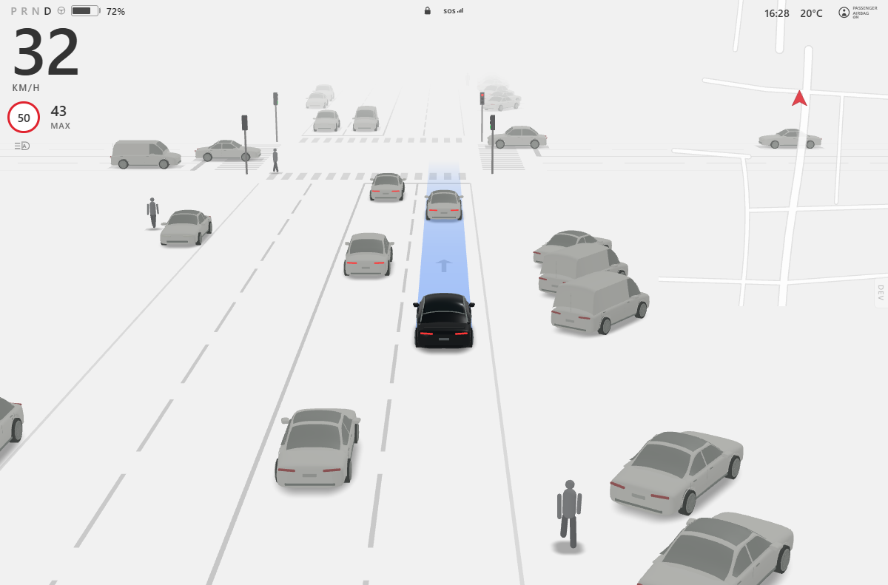
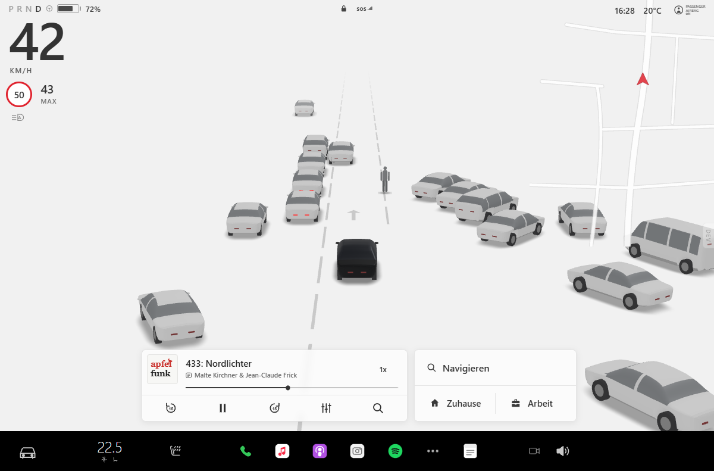

# Driving Visualization (Tesla-style) — Three.js recreation

An interactive 3D recreation of the Tesla Model 3/Y driving-visualization screen: pale gray
perception world, elevated long-lens rear camera, black ego car, simplified gray vehicles, lane
markings, pedestrians, and the HTML/CSS instrument cluster, status icons and mini-map. (The media,
navigation and dock overlays of the original photo were removed on request — the screen is the
driving visualization itself.)

Everything renders from a real Three.js scene (vehicles, wheels, pedestrians and lane geometry are
3D objects in world coordinates). The rendering library is bundled from `node_modules`; all vehicle
models are generated procedurally at start-up, so the app makes **no runtime requests to third-party
CDNs and needs no downloaded assets**.





Reference mode with this app's own loft models instead (`?cars=loft`): `screenshots/reference-loft.png`.

## Run it

```bash
npm install
npm run dev        # http://127.0.0.1:5180/
```

Production build and preview:

```bash
npm run build      # type-check + bundle into dist/
npm run preview    # serves dist/ on http://127.0.0.1:5181/
```

`dist/` is fully static — copy it to any web server (relative asset paths are used).

Tests (simulation invariants + loft geometry checks):

```bash
npm test
```

Headless screenshot of the running app (uses the locally installed Edge/Chrome via puppeteer-core;
also reports console errors and any non-same-origin request):

```bash
npm run screenshot -- --url http://127.0.0.1:5180/ --out screenshots/reference.png
npm run screenshot -- --query "mode=live" --wait 4000 --out screenshots/live.png
```

## Using the app

The page opens **driving**: the ego car follows a generated city route at up to 42 km/h — lane and
cross traffic, oncoming cars, lane changes, parked rows, pedestrians crossing on walk phases,
signalised and stop-sign intersections, and turns at intersections (the world rotates around the
car, the blue planned path bends into the new street). The speed readout and posted limit follow the
simulation; the mini-map scrolls.

Three modes (developer panel — the small `DEV` tab on the right edge, or the `D` key):

| Mode | What it shows |
| --- | --- |
| **Live** (default) | The living world above. Deterministic: the same elapsed-time sequence gives the same drive. |
| **Reference** | The frozen arrangement from the reference photo, for side-by-side comparison. |
| **Perception** | Camera → neural network → 3D. A COCO-SSD detector (bundled, runs in the browser) finds cars, trucks, buses, people and bikes in a camera feed; a tracker stabilises them; a ground-plane projection places them in the 3D scene. The picture-in-picture shows the frame the network sees with its boxes. |

Perception sources: **Synthetic front camera** (a hidden second renderer draws the live world from
the ego's windshield — the detector only ever sees those pixels, so what reaches the main view came
through the network), **Video file** (pick a dashcam `.mp4`; it never leaves your machine), or
**Webcam**. Calibration sliders: camera field of view, camera height, horizon row, and the speed to
assume when the source has no odometry. Lane lines in perception mode are *assumed straight* — lane
detection is not part of this pipeline.

**Car models.** Two sets are included and switchable in the developer panel (or `?cars=dv|loft`):
the default is the vehicle set from the sibling `driving-visualization` project (its
`lib/driving/vehicles.ts`, copied verbatim into `src/render/vehicles/dv/` — sculpted bodies with
compound-curved glass, door seams, fender lips, five-spoke wheels), adapted by `dvTemplate.ts` to this
app's +Z-forward frame and merged per material (≈ 9 draw calls per car; tail lamps stay separate so
brake lights work). `loft` selects this app's own cross-section lofts.

Other controls: Pause / Resume, Reset, speed factor 0.25×–3×, planned-path corridor on/off, camera
rig sliders (fov / back / height / ahead / lateral / fog), "Simulate context loss", "Save frame PNG".
Keyboard: `Space` pause/resume, `R` reset, `L` live/reference, `P` perception, `T` corridor,
`[` / `]` speed, `D` panel. Nothing is connected to real vehicle or navigation services.

`prefers-reduced-motion: reduce` keeps the scene frozen until the live demo is explicitly started.

URL parameters: `?mode=live|reference|perception`, `?skip=60` (pre-advance the live world 60 s —
deterministic, handy for screenshots), `?speed=2`, `?corridor=0`, `?hud=0`, `?dev=1`,
`?tfBackend=webgl|cpu`, camera overrides such as `?fov=27.4&back=43.6&height=13.1&ahead=6.5`,
`?probe=sedan|crossover|van|ego&yaw=145` (single-model viewer), `?simulateError=1`.

## Real-map world: Berlin (step 1 of the training-environment plan)

Live mode now drives a **real road network built from OpenStreetMap**: Prenzlauer Berg around
Kollwitzplatz (≈ 1.4 × 1.4 km, `public/maps/berlin-prenzlauer-berg.json`, ODbL — see
`public/maps/LICENSE.txt`). The extract is fetched once with `scripts/fetch-osm.mjs` (Overpass API)
and served by the app itself, so runtime stays offline.

What is derived from the map data (`src/world/map/`):

- **Roads** — ways split at shared nodes into polyline segments (curves preserved), degree-2
  continuations merged, ends trimmed at junctions; lane counts from `lanes`, `lanes:forward/backward`,
  `oneway`; speed limits from `maxspeed` (30/50 zones); road class from `highway`.
- **Junctions** — any node where segment ends meet; signalised when a `traffic_signals` node sits
  on or within 30 m of it (two-phase cycle grouped by arm axis); otherwise priority by road class or
  "rechts vor links" between equal streets; left turns yield to oncoming traffic.
- **Movements** — Hermite connectors between lane ends through each junction (straight / left /
  right classified by heading), lane choice per movement.
- **Crossings** — `highway=crossing` nodes (zebra / signal-controlled / unmarked); pedestrians walk
  the sidewalks and cross at them when allowed.
- **Parking** — `parking:left/right/both` (+ orientation: parallel, diagonal, perpendicular) fill
  the kerbside with parked cars, which is why Kollwitzstraße shows its real perpendicular rows.
- **Buildings** — footprints (`building=*`) extruded as low slabs to show the street layout.
- **Ego route** — a deterministic walk through the network preferring to continue straight and
  avoiding recently visited streets; the current street name is shown on screen.

Switch worlds in the developer panel (`World:`) or with `?world=generated`; another extract can be
fetched with `node scripts/fetch-osm.mjs --name <name> --bbox S,W,N,E` and loaded via `?map=<name>`.

**OpenDRIVE export** (`npx vite-node scripts/export-xodr.ts`, or the "Export OpenDRIVE" button):
`exports/<map>.xodr` with one road per segment (polyline `line` geometry, driving lanes per
direction, speed limits) and junctions with connecting roads per movement, so the same network can
be loaded into CARLA, esmini or MetaDrive. Structural validity (links, ids, geometry lengths) is
covered by tests; loading it in CARLA/esmini was not run on this machine.

Known simplifications: no lane-level turn restrictions, no tram tracks, no elevation, single lane
per movement in the export, and the visual buildings are height-capped.

## How it is built

```
src/
  world/              world model — independent of rendering
    types.ts          WorldState: ego, vehicles, pedestrians, markings, crosswalks, signals, signs, route
    reference.ts      the frozen arrangement estimated from the reference photo
    geometry.ts       frames + a line/arc Path (the ego's route)
    network.ts        road network: legs, intersections, signal phases, turn arcs
    live.ts           the live world: ego controller, traffic (IDM car-following, lane changes,
                      signals, stop signs), parked rows, pedestrians, markings/props output
    simulation.ts     mode orchestration (reference / live, generated ↔ map world), deterministic sub-stepping
    map/              real-map world: osm.ts (extract + projection), polyline.ts, network.ts
                      (segments, junctions, lanes, signals, crossings, parking), mapWorld.ts
                      (traffic + ego on the network), xodr.ts (OpenDRIVE export), load.ts
  perception/         camera → NN → 3D
    detector.ts       COCO-SSD (SSDLite MobileNetV2) via TensorFlow.js, model served from public/
    projection.ts     box bottom-edge → ground-plane distance / lateral offset, class → body kind
    tracker.ts        nearest-neighbour association, smoothing, confirmation and coasting
    sources.ts        synthetic front camera (hidden renderer), video file, webcam
    perception.ts     the async detection loop and the WorldState it produces each frame
  render/
    SceneRenderer.ts  Three.js scene, chase / dashcam camera rigs, lights, fog; update(state)
    vehicles/         car models: dv/ (driving-visualization set, default) adapted by dvTemplate.ts,
                      plus this app's lofts (loft.ts, specs.ts); assembly in buildVehicle.ts
    ground.ts         polyline markings, zebra crossings, arrows, the curved path ribbon
    props.ts          traffic signals and stop signs; pedestrian.ts, environment.ts, blobShadow.ts
  ui/                 HUD scaling + developer panel
  main.ts             bootstrap, mode switching, PiP overlay, error overlay/retry, context loss
public/models/coco-ssd/  detector weights (Apache-2.0, TensorFlow model garden), ~18 MB
```

Every producer (live simulation, perception pipeline) emits a plain `WorldState`; the renderer only
reads it, so another data source can be connected by producing that structure.

### Camera

A long-lens perspective camera (27.4° vertical FOV) sits 43.6 m behind and 13.1 m above the ego,
aimed 6.5 m ahead of it. These numbers were solved from the reference photo (object size ratios
and the vertical spread of the queue) and then refined against screenshots. An orthographic camera
was considered but rejected: the reference shows clear, if restrained, perspective convergence in
the lane lines and vehicle sizes.

### Vehicles

Each body is a loft of cross-section rings along the length. Five profile curves (roof/hood height,
belt line, plan-view half-width, roof-width ratio, underside height) plus corner-rounding radii define
the shape; wheel arches are cut by raising the underside around the axles. The ring is sampled in three
fixed segments (lower body, greenhouse side, roof) so the belt line is an exact vertex row and the
glass/body boundary is crisp; windshield and rear window are detected from the roof-profile slope.
Faces are grouped into body / glass / lower-trim materials. Wheels, lights and mirror housings are
merged per vehicle type (≈ 9 draw calls per vehicle).

## Verification performed

- Unit tests (`npm test`): path/arc geometry, turn arcs landing on the ego lane, signal phases never
  green for conflicting movements (protected left turns), 300 s of simulated driving with turns and
  red-light stops and no vehicle/pedestrian collisions, determinism, pause/speed/reset, loft
  geometry sanity.
- Browser: first load renders the full scene and drives immediately; console clean; all requests
  same-origin (detector weights included); live/pause/resume/reset/speed/corridor controls verified;
  context loss → banner → automatic rebuild; simulated init failure → overlay → Retry recovers;
  layouts checked at 1200×791, 900×560, 480×800.
- Screenshots in `screenshots/` are produced with `scripts/screenshot.mjs` (headless Edge).
- Map world: `tests/map.test.ts` builds the Berlin network, checks connectors, runs 240 s of
  traffic with no collisions, and validates the OpenDRIVE export's links and geometry.
- Perception: `tests/perception.test.ts` covers the projection maths and the tracker. The bundled
  network was verified offline with `npm run nn-check`: it loads the local weights and runs them on a
  frame captured from the app's synthetic front camera (`screenshots/frame.b64`, produced by the
  `--eval` snippet in `scripts/nn-check.mjs`), detecting the cars in it. In-browser, the WebGL backend
  initialised and the model loaded in ~8 s on this machine's GPU; live detection at ~10 Hz needs a
  visible tab with hardware WebGL — the headless software renderer used for the screenshots is far too
  slow for the network (≈ 90 s per frame), so live perception screenshots are not included.
